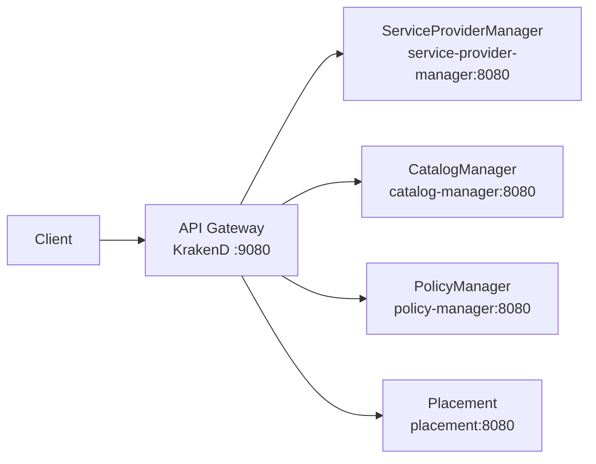

# DCM API Gateway

Central clearing house for the DCM control plane: single entry point (ingress) and single exit point (egress) for all communication.

## Overview

- **Ingress:** Clients and frontends send REST requests to the gateway; the gateway routes them to internal managers (ServiceProviderManager, PlacementManager, PolicyManager, CatalogManager).
- **Egress:** Outbound calls from DCM to external systems are intended to go through the gateway (see [Egress](#egress) below). Placeholders only in this deliverable.
- **Stateless:** No server-side sessions; each request is independent.
- **Auth:** Not in scope for the first deliverable; Keycloak (or another IdP) will be added later.



## Running the gateway

### Prerequisites

- [KrakenD](https://www.krakend.io/) (see [installation guide](https://www.krakend.io/docs/overview/installing/) or use the container image).

### Validate config

```bash
make validate-config
```

### Run locally (full stack)

From the `api-gateway` directory, run the gateway and all managers via Compose. This runs `clone-deps` then starts the stack:

```bash
cd api-gateway
make run
```

The gateway is at `http://localhost:9080`. Stop with `make compose-down`. To run only the gateway binary on the host (no Compose, e.g. when backends are elsewhere), use `make run-gateway-only`.

**Credentials:** Compose uses `POSTGRES_USER` and `POSTGRES_PASSWORD` (defaults: `admin` / `adminpass` for local dev). To override, set them in the environment or in a `.env` file (see `.env.example`).

**Temporary approach:** `make run` calls `clone-deps`, which clones the four manager repos into a temporary directory (default `$TMPDIR/dcm-compose-repos` or `/tmp/dcm-compose-repos`) so you don't need them as siblings. It writes `DCM_MANAGERS_DIR` into `.env` so `podman compose` finds them. Override the clone location with `DCM_MANAGERS_DIR` (e.g. `DCM_MANAGERS_DIR=../ make clone-deps` then `make compose-up`). Then open `http://localhost:9080` (e.g. `curl -s http://localhost:9080/api/v1alpha1/health/providers`).

**Future (quay.io):** Manager container images are not yet published. Once they are (e.g. to quay.io/dcm-project), we can switch this compose to use `image:` instead of building from source—no cloning. Building and pushing images on PR merge (e.g. in CI) is the intended next step.

### Backend URL configuration

Backend base URLs are defined in `config/krakend.json`. The default is **cluster-style**: one host per service, same port (8080), e.g. `http://catalog-manager:8080`:

| Backend                | Default (cluster)                   |
|------------------------|-------------------------------------|
| ServiceProviderManager | `http://service-provider-manager:8080` |
| CatalogManager         | `http://catalog-manager:8080`       |
| PolicyManager          | `http://policy-manager:8080`        |
| Placement              | `http://placement:8080`             |

For the full stack, use Compose. To override backend hosts with env vars (e.g. another environment), see `config/krakend.json.tmpl` and [Flexible Config](https://www.krakend.io/docs/configuration/flexible-config/).

### Testing locally

1. **Validate and start the full stack**
   ```bash
   make validate-config
   make run
   ```
   The gateway is at `http://localhost:9080`.

2. **Smoke test (gateway only)**  
   With no backends running, use `make run-gateway-only` and check:
   ```bash
   curl -s http://localhost:9080/__health
   ```
3. **Full test (gateway + backends)**  
   After `make run`, try e.g. `curl -s http://localhost:9080/api/v1alpha1/health/providers`. Stop with `make compose-down`.

## Route mapping

| Path prefix                              | Backend                |
|------------------------------------------|------------------------|
| `/api/v1alpha1/health/providers`         | ServiceProviderManager |
| `/api/v1alpha1/health/catalog`           | CatalogManager         |
| `/api/v1alpha1/health/policies`          | PolicyManager          |
| `/api/v1alpha1/health/placement`         | Placement              |
| `/api/v1alpha1/providers`                | ServiceProviderManager |
| `/api/v1alpha1/service-types`            | CatalogManager         |
| `/api/v1alpha1/catalog-items`            | CatalogManager         |
| `/api/v1alpha1/catalog-item-instances`   | CatalogManager         |
| `/api/v1alpha1/policies`                 | PolicyManager          |
| `/api/v1alpha1/applications`             | Placement              |

Health paths above are GET-only; other paths support multiple methods (GET, POST, PUT, DELETE as per the API).

**Health:** Backend health is exposed through the gateway. Use `GET /api/v1alpha1/health/providers`, `/health/catalog`, `/health/policies`, `/health/placement` to check each manager (e.g. `curl http://localhost:9080/api/v1alpha1/health/catalog`). KrakenD also exposes `GET /__health` for the gateway process only.

## Egress

Egress (outbound traffic from DCM to external Service Providers) is **documented** and **placeholders** are present in the config; there is no full implementation in this deliverable.

**Intended model:** The gateway will act as the single **exit** point: when a manager (or the platform) needs to call an external Service Provider, the call will go **manager → gateway → external SP**. That gives one place for policy, logging, and TLS to external SPs.

**In this repo:** See `config/krakend.json` for commented egress endpoint examples. When the egress flow is implemented, extend the gateway config with active routes for outbound to SPs.

## Authentication (future)

Authentication and token validation (e.g. Keycloak, JWT) are **not** in the first deliverable. When added, the gateway will validate tokens and forward identity to backends; KrakenD supports JWT validation and Keycloak integration via plugins.