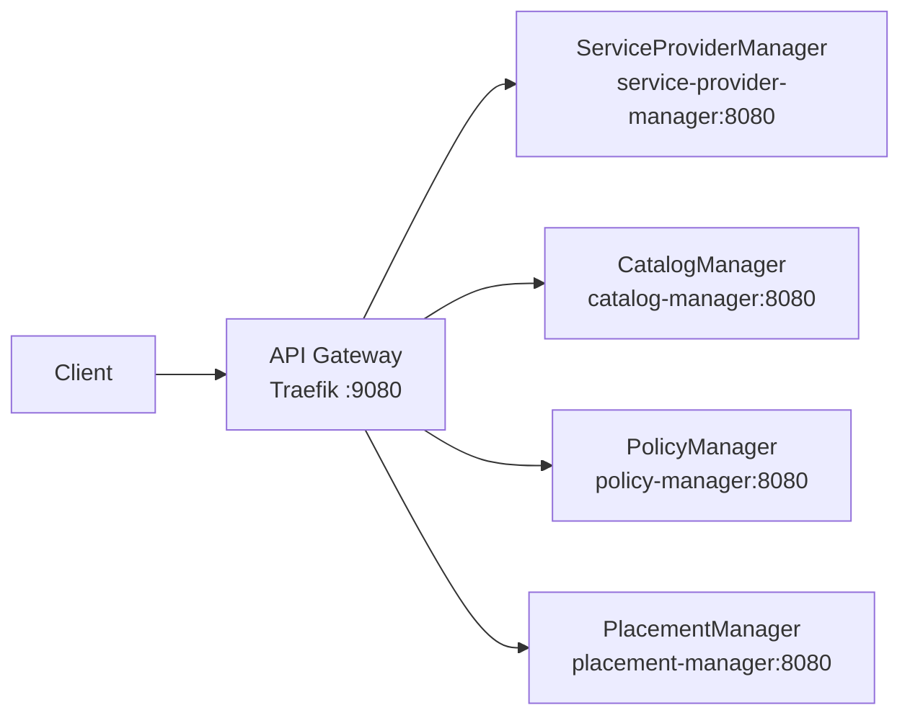

# DCM API Gateway

Central clearing house for the DCM control plane: single entry point (ingress) and single exit point (egress) for all communication.

## Overview

- **Ingress:** Clients and frontends send REST requests to the gateway; the gateway routes them to internal managers (ServiceProviderManager, PlacementManager, PolicyManager, CatalogManager).
- **Egress:** Outbound calls from DCM to external systems are intended to go through the gateway (see [Egress](#egress) below). Placeholders only in this deliverable.
- **Stateless:** No server-side sessions; each request is independent.
- **Auth:** Not in scope for the first deliverable; Keycloak (or another IdP) will be added later.



## Running the gateway

### Prerequisites

- [Traefik](https://doc.traefik.io/traefik/) (see [installation guide](https://doc.traefik.io/traefik/getting-started/install-traefik/) or use the container image).

### Validate config

```bash
make validate-config
```

### Run locally (full stack)

From the `api-gateway` directory, pull the manager images from `quay.io/dcm-project` and start the full stack via Compose:

```bash
cd api-gateway
make run
```

The gateway is at `http://localhost:9080`. Stop with `make compose-down`. To run only the gateway binary on the host (no Compose, e.g. when backends are elsewhere), use `make run-gateway-only`.

**Credentials:** Compose uses `POSTGRES_USER` and `POSTGRES_PASSWORD` (defaults: `admin` / `adminpass` for local dev). To override, set them in the environment or in a `.env` file (see `.env.example`).

### Gateway configuration

The gateway uses [Traefik's file provider](https://doc.traefik.io/traefik/providers/file/) to load routing configuration from YAML files. This approach works identically in Docker Compose and Kubernetes (via ConfigMap), enabling a single configuration for both deployment targets.

| File | Purpose |
|---|---|
| `config/traefik.yml` | Static configuration — entrypoints, providers, logging |
| `config/dynamic/routes.yml` | Dynamic configuration — routers, services, and middleware |

**Adding or modifying an endpoint** only requires editing `config/dynamic/routes.yml`. Routes are grouped by backend service. Each backend is defined as a Traefik service with a load balancer URL, and routers match request paths to services.

After editing, validate with `make validate-config`.

### Kubernetes deployment

The same configuration files work in Kubernetes. Mount them as a ConfigMap:

```bash
kubectl create configmap traefik-config \
  --from-file=traefik.yml=config/traefik.yml \
  --from-file=routes.yml=config/dynamic/routes.yml
```

Then mount the ConfigMap into the Traefik pod at `/etc/traefik/traefik.yml` and `/etc/traefik/dynamic/routes.yml`.

### Testing locally

1. **Validate and start the full stack**
   ```bash
   make validate-config
   make run
   ```
   The gateway is at `http://localhost:9080`.

2. **Smoke test (gateway only)**
   With no backends running, use `make run-gateway-only` and check:
   ```bash
   curl -s http://localhost:9080/ping
   ```
3. **Full test (gateway + backends)**
   After `make run`, try e.g. `curl -s http://localhost:9080/api/v1alpha1/health/providers`. Stop with `make compose-down`.

## Route mapping

| Path prefix                              | Backend                |
|------------------------------------------|------------------------|
| `/api/v1alpha1/health/providers`         | ServiceProviderManager |
| `/api/v1alpha1/health/catalog`           | CatalogManager         |
| `/api/v1alpha1/health/policies`          | PolicyManager          |
| `/api/v1alpha1/health/placement`         | PlacementManager       |
| `/api/v1alpha1/providers`                | ServiceProviderManager |
| `/api/v1alpha1/service-type-instances`   | ServiceProviderManager |
| `/api/v1alpha1/service-types`            | CatalogManager         |
| `/api/v1alpha1/catalog-items`            | CatalogManager         |
| `/api/v1alpha1/catalog-item-instances`   | CatalogManager         |
| `/api/v1alpha1/policies`                 | PolicyManager          |
| `/api/v1alpha1/resources`                | PlacementManager       |

Health paths above are GET-only; other paths support multiple methods (GET, POST, PUT, PATCH, DELETE as per the API). The `catalog-item-instances` prefix also covers AEP custom methods such as `POST /api/v1alpha1/catalog-item-instances/{id}:rehydrate`. See `config/dynamic/routes.yml` for the full list.

**Health:** Backend health is exposed through the gateway. Use `GET /api/v1alpha1/health/providers`, `/health/catalog`, `/health/policies`, `/health/placement` to check each manager (e.g. `curl http://localhost:9080/api/v1alpha1/health/catalog`). Traefik also exposes `GET /ping` for the gateway process only.

## Egress

Egress (outbound traffic from DCM to external Service Providers) is **documented** and **placeholders** are present in the config; there is no full implementation in this deliverable.

**Intended model:** The gateway will act as the single **exit** point: when a manager (or the platform) needs to call an external Service Provider, the call will go **manager → gateway → external SP**. That gives one place for policy, logging, and TLS to external SPs.

**In this repo:** When the egress flow is implemented, add outbound routes to `config/dynamic/routes.yml`.

## Authentication (future)

Authentication and token validation (e.g. Keycloak, JWT) are **not** in the first deliverable. When added, the gateway will validate tokens and forward identity to backends using Traefik's [ForwardAuth middleware](https://doc.traefik.io/traefik/middlewares/http/forwardauth/).
